# Enchère Hollandaise

| Nom    | Prénom |
|--------|--------|
| Doubli | Akram  |

📌 **Note importante** : Le projet a été entièrement terminé **le vendredi 14 février 2025**, avec la dernière modification effectuée ce même jour. Cependant, en raison d'une **indisponibilité de GitLab** depuis **le jeudi 13 février jusqu’au mardi 19 février**, il n’a pas été possible de **pousser les commits** avant aujourd’hui. C’est pourquoi le push final a été réalisé seulement le **19 février 2025**.

## 📖 Table des Matières

- [📝 Introduction](#-introduction)
- [🚀 Fonctionnalités Principales](#-fonctionnalités-principales)
- [📂 Organisation des Fichiers](#-organisation-des-fichiers)
- [🔍 Explication du Smart Contract](#-explication-du-smart-contract)
- [✅ Tests Unitaires du Smart Contract](#-tests-unitaires-du-smart-contract)
- [📦 Installation et Déploiement](#-installation-et-déploiement)
- [🎨 Interface Utilisateur](#-interface-utilisateur)
- [⚠️ Remarque : Tester avec plusieurs comptes](#-remarque--tester-avec-plusieurs-comptes)
- [📊 Fonctionnement de l’Application](#-fonctionnement-de-lapplication)
- [🔚 Conclusion](#-conclusion)

## 📝 Introduction

Ce projet implémente un **système d'enchères hollandaises décentralisées** basé sur la blockchain Ethereum. Contrairement aux enchères classiques, ici le prix **diminue automatiquement** au fil du temps jusqu'à atteindre un prix de réserve ou être acheté par un acheteur.

Le **Smart Contract Solidity** gère la création, l’ajout d’articles, la réduction des prix, l’achat et la clôture des enchères. Une **interface React** permet aux utilisateurs de **créer, gérer et participer** aux enchères de manière intuitive avec MetaMask.

## 🚀 Fonctionnalités Principales

| **Côté Smart Contract** | **Côté Frontend** |
|----------------------------|----------------------|
| **Création d'une enchère** | **Affichage des enchères disponibles** |
| **Ajout d’articles à une enchère** | **Création et gestion des enchères par le vendeur** |
| **Démarrage d’une enchère** | **Affichage du statut des enchères (en cours, clôturées, non commencées)** |
| **Mécanisme de réduction du prix avec le temps** | **Interface utilisateur élégante et responsive** |
| **Achat d’un article avec gestion des paiements** | **Page Historique pour consulter les articles achetés** |
| **Passage automatique au prochain article** | **Participation des acheteurs aux enchères** |
| **Clôture automatique de l’enchère** |  |


## 📂 Organisation des Fichiers
- **Smart Contracts (/contracts) :** Définition de la logique d’enchère.
- **Frontend React (/frontend) :** Interface utilisateur.
- **Scripts (/scripts) :** Déploiement des contrats.
- **Tests (/test) :** Vérification du bon fonctionnement du contrat.

## 🔍 5. Explication du Smart Contract

### 📜 DutchAuction.sol

Le Smart Contract **DutchAuction** implémente une enchère hollandaise où le prix des articles diminue avec le temps. Il gère la création d’enchères, l’ajout d’articles, et l’interaction avec les acheteurs.

### 🏗️ **Structures Principales**
- **`struct Article`** : Représente un article avec ses propriétés telles que le prix de départ, le prix réservé, la réduction de prix, l’état de vente et l’acheteur.
- **`struct Auction`** : Définit une enchère, contenant une liste d'articles, l’état de l’enchère et son vendeur.

### ⚙️ **Fonctions Principales**
- **`createAuction()`** : Crée une nouvelle enchère vide.
- **`addArticle()`** : Ajoute un article à une enchère avant son démarrage.
- **`startAuction()`** : Démarre l’enchère et initialise le premier article.
- **`getCurrentPrice()`** : Calcule le prix actuel d’un article en fonction du temps écoulé.
- **`buy()`** : Permet à un utilisateur d’acheter un article au prix actuel.
- **`checkAuctionStatus()`** : Vérifie si l’enchère doit passer à l’article suivant ou se clôturer automatiquement.
- **`getArticleCount()`** : Retourne le nombre total d’articles dans une enchère donnée.
- **`getArticle()`** : Récupère les informations détaillées d’un article spécifique.

En plus, le Smart Contract utilise des **événements** pour informer le frontend et d'autres applications de l'évolution des enchères :
- **`AuctionCreated()`** : Indique la création d’une nouvelle enchère.
- **`AuctionStarted()`** : Signale le démarrage de l’enchère.
- **`ArticleAdded()`** : Notifie l’ajout d’un nouvel article.
- **`ArticleSold()`** : Informe lorsqu’un article a été acheté avec succès.
- **`AuctionEnded()`** : Confirme que l’enchère est terminée.

## ✅ 6. Tests Unitaires du Smart Contract

J'ai réalisé une série de **tests unitaires** pour valider le bon fonctionnement du Smart Contract **DutchAuction**. Ces tests couvrent les principales fonctionnalités et garantissent que le contrat fonctionne comme prévu.

### 🔍 **Liste des tests effectués**

#### 📌 **Gestion des enchères**
- ✅ **Doit créer une enchère correctement**
- ✅ **Ajoute des articles correctement**
- ✅ **Empêche d'ajouter des articles après le démarrage**
- ✅ **Démarre l'enchère correctement**
- ✅ **Met à jour le prix des articles au fil du temps**

#### 🛒 **Achat des articles**
- ✅ **Permet d'acheter un article au prix actuel**
- ✅ **Passe automatiquement à l'article suivant après un achat**
- ✅ **Clôture l'enchère après la vente du dernier article**
- ✅ **Clôture automatiquement une enchère si le dernier article atteint le prix réservé**
- ✅ **Vérifie que `auctionEnded` est bien `true` après le dernier article**
- ✅ **Vérifie que `currentArticleIndex` est mis à jour après un achat**
- ✅ **Empêche l'achat d'un article déjà vendu**
- ✅ **Stocke la date d'achat correcte après l'achat d'un article**

#### 💰 **Gestion des paiements**
- ✅ **Transfère correctement le montant au vendeur après l'achat**

#### 🔒 **Sécurité & Restrictions**
- ✅ **Empêche un non-vendeur de démarrer une enchère**
- ✅ **Empêche un acheteur d'acheter un article avant le début de l'enchère**

---

### 📜 **Exécution des tests**
Pour exécuter les tests unitaires, utilisez la commande suivante :

```
npx hardhat test
```
Une fois l'exécution terminée, vous obtiendrez le résultat ci-dessous :

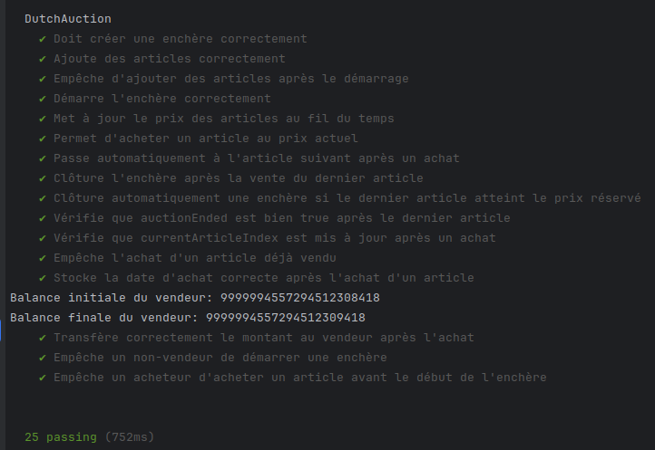

---

## 📦 Installation et Déploiement

### 🛠️ Prérequis

- ✅ **Node.js et npm**
- ✅ **Hardhat** pour compiler et tester le Smart Contract
- ✅ **MetaMask** pour interagir avec la blockchain

### 🔧 Installation

```bash
git clone  https://www-apps.univ-lehavre.fr/forge/da204275/dutch-auction.git
cd dutch-auction
npm install
```

### 📡 Déploiement du Smart Contract (Localhost)

1️⃣ **Lancer un nœud Hardhat** (dans un premier terminal) :
```bash
npx hardhat node
```

2️⃣ **Déployer le Smart Contract** (dans un second terminal) :
```bash
npx hardhat run scripts/deploy.js --network localhost
```

⚠️ **Remarque importante : Adresse du Smart Contract** ⚠️

L'adresse du Smart Contract (`CONTRACT_ADDRESS`) définie dans le fichier `contract.js` est générée dynamiquement à chaque déploiement sur le réseau local (`localhost`).  
Si vous déployez le Smart Contract sur votre propre environnement, **vous obtiendrez une adresse différente**.

Après avoir exécuté la commande :
```sh
npx hardhat run scripts/deploy.js --network localhost
```
L'adresse du contrat sera affichée dans le terminal. 
```
Smart Contract déployé à : 0x5FbDB2315678afecb367f032d93F642f64180aa3
```
Vous devez mettre à jour cette adresse dans `frontend/src/utils/contract.js` :

3️⃣ **Démarrer l'application React avec Vite** (dans un troisième terminal) :
```bash
cd frontend
npm run dev
```
---

## 🎨 Interface Utilisateur

- 📌 **Accueil** : Liste des enchères créées par d’autres vendeurs.
- 📌 **Mes Enchères** : Page où le vendeur peut gérer ses enchères.
- 📌 **Historique** : Liste des articles achetés par l’utilisateur connecté.
- 📌 **Enchère** : Page affichant les articles en cours et leur prix.

---

## ⚠️ Remarque : Tester avec plusieurs comptes

Pour tester correctement l'application, il est recommandé d'utiliser **plusieurs comptes de test** sur MetaMask. Cela permet de :

- **Simuler différents rôles** : Un utilisateur peut être **vendeur** en créant des enchères et **acheteur** en participant aux enchères d'autres vendeurs.
- **Tester les interactions blockchain** entre plusieurs comptes (ex. : un utilisateur crée une enchère et un autre achète un article).
- **Vérifier les permissions** : Seul le vendeur peut gérer ses propres enchères, tandis que les acheteurs ne peuvent qu'enchérir sur celles des autres.

### 🔹 Comment ajouter plusieurs comptes de test sur MetaMask ?
1. Ouvrir **MetaMask** et accéder aux paramètres.
2. Créer un **nouveau compte** ou importer une **clé privée** d’un compte de test.
3. Sélectionner **localhost:8545** comme réseau pour interagir avec Hardhat.

---

## 📊 Fonctionnement de l’Application

### 1️⃣ Création d’une Enchère
- Un vendeur crée une enchère via l’interface (page d'accueil).

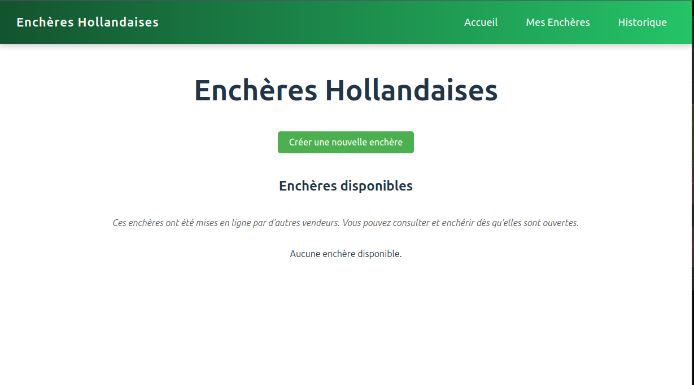

- Il ajoute des articles avec un prix de départ, un prix réservé et un intervalle de décrément.

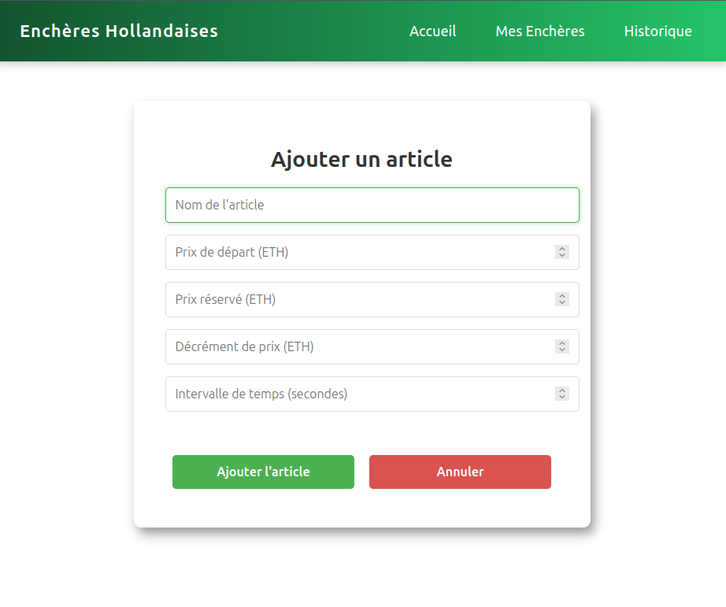


---

### 2️⃣ Démarrage de l’Enchère
- L’enchère commence dès que le vendeur appuie sur **Start** dans la page **Mes Enchères**.


  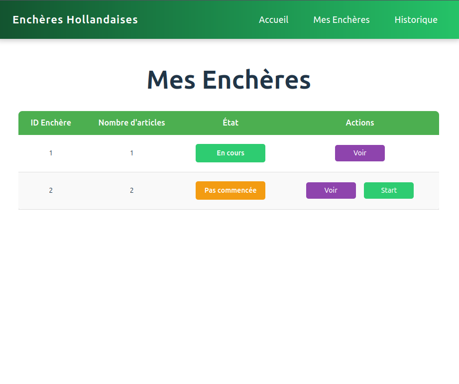


- En se connectant avec un autre compte MetaMask, celui-ci sera considéré comme un acheteur. Sur sa page d’accueil, il pourra voir les enchères créées par d’autres vendeurs ainsi que leur statut.


  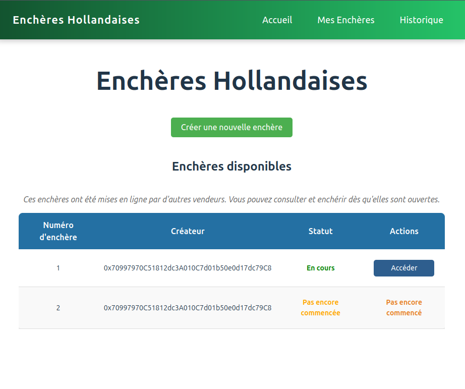

  - Ensuite, il peut accéder à une enchère déjà commencée et procéder à l'achat d'un article.
  
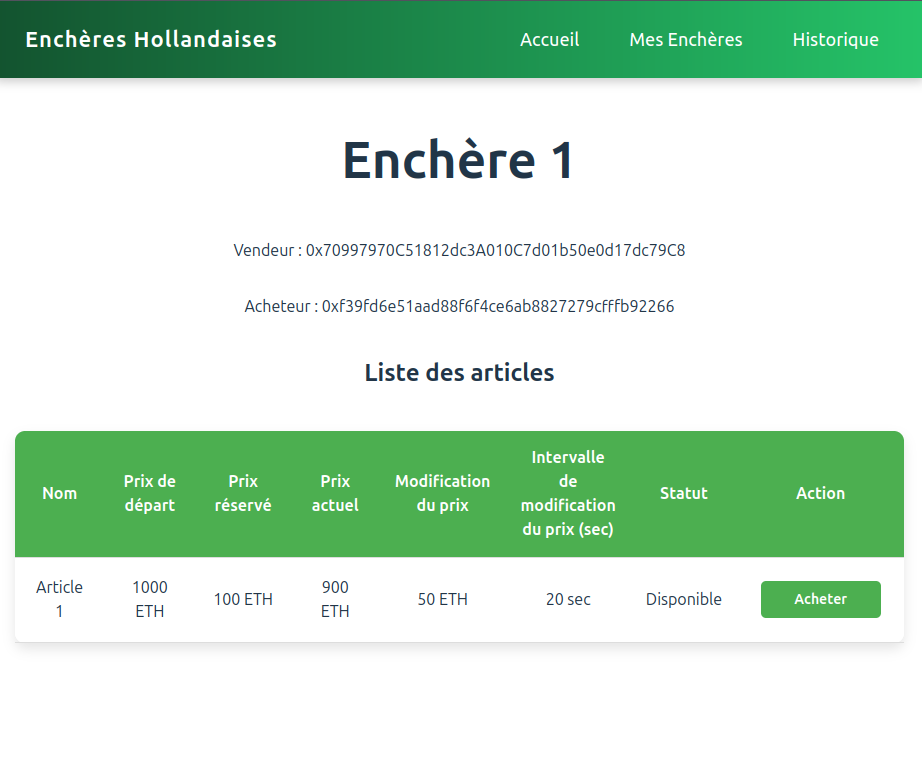

- Le prix des articles diminue automatiquement toutes les `timeInterval` secondes.
---

### 3️⃣ Achat d’un Article
- Un acheteur peut acheter un article au prix actuel.
- Une transaction blockchain est initiée et l’article est marqué comme **vendu**.

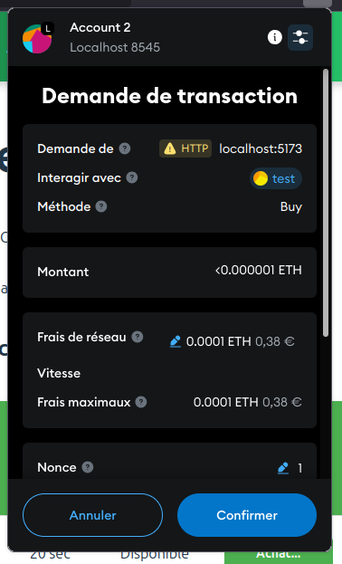

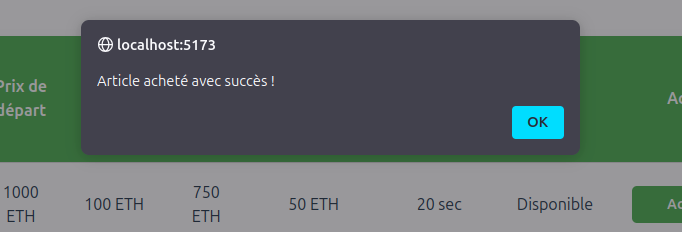

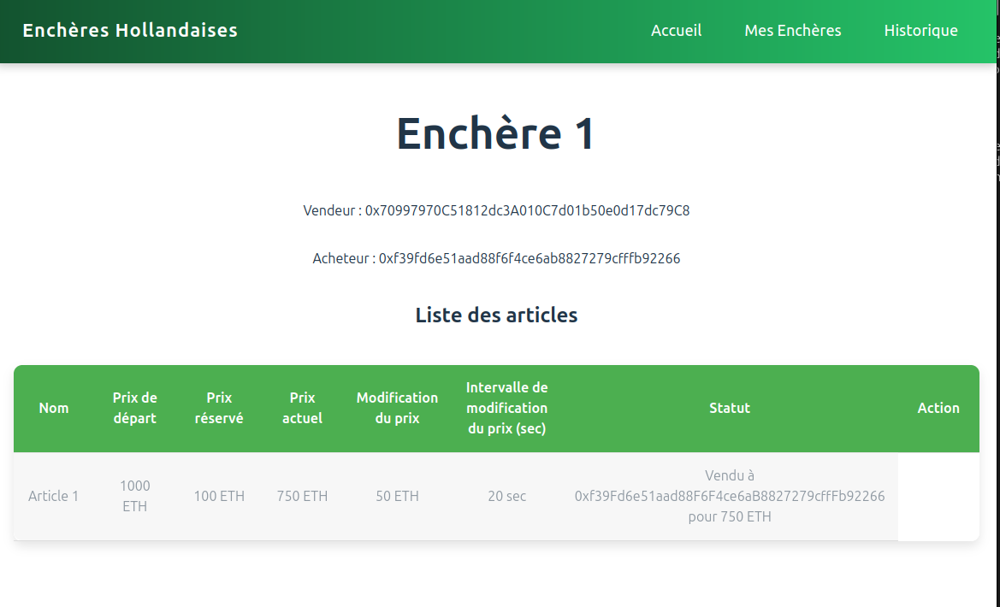

- Il est possible de consulter le terminal où la commande npx hardhat node a été exécutée pour observer le résultat ci-dessous :   

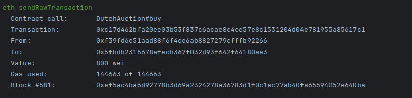

---

### 4️⃣ Passage à l’article suivanta
- Si l’article est acheté ou atteint le prix minimum, on passe automatiquement au prochain article (j'ai créé une autre enchère avec deux articles).
- 

  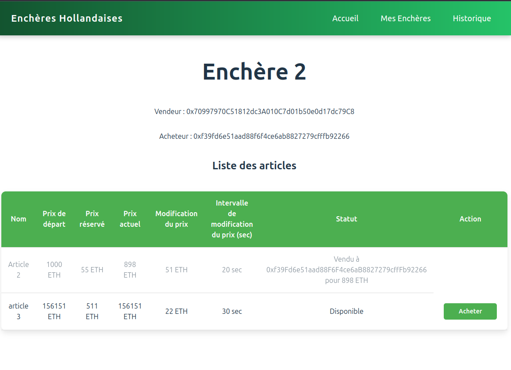

---

### 5️⃣ Clôture de l’enchère
- Lorsque le dernier article est vendu ou atteint son prix minimum, l’enchère est **clôturée**.

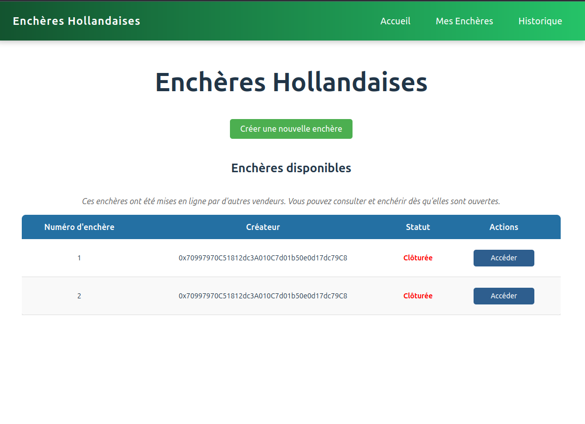

### 6️⃣ Transactions sur la Blockchain
- Toute interaction modifiant l’état du Smart Contract (création d’enchère, ajout d’articles, achat, clôture…) nécessite une transaction validée par la blockchain.
- Cela implique des frais de **gas**, et chaque transaction doit être confirmée via MetaMask.

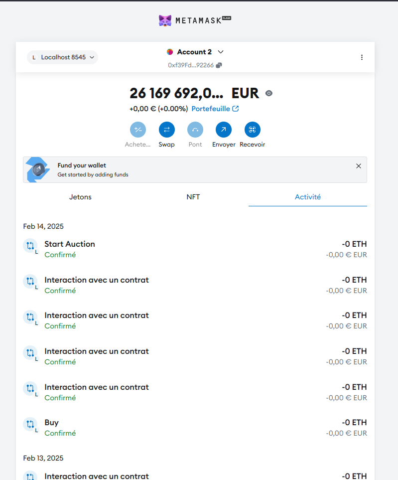

## 🔚 Conclusion

Ce projet d'**enchères hollandaises décentralisées** a permis d'explorer et d'implémenter un **Smart Contract Solidity** et une **application React** connectée à la blockchain.

J'ai réussi à implémenter les fonctionnalités prévues, notamment la gestion des enchères, l'ajout et l'achat d'articles avec une **réduction automatique du prix** et une **clôture automatique** des enchères.

Cependant, certaines **difficultés** ont été rencontrées :
- **Gestion du temps dans le Smart Contract** : Calcul du prix actuel en fonction du temps écoulé.
- **Mise à jour des états en temps réel** : Synchronisation du frontend avec les changements du Smart Contract.
- **Tests et déploiement** : Configuration de Hardhat et vérification du bon fonctionnement des transactions.

